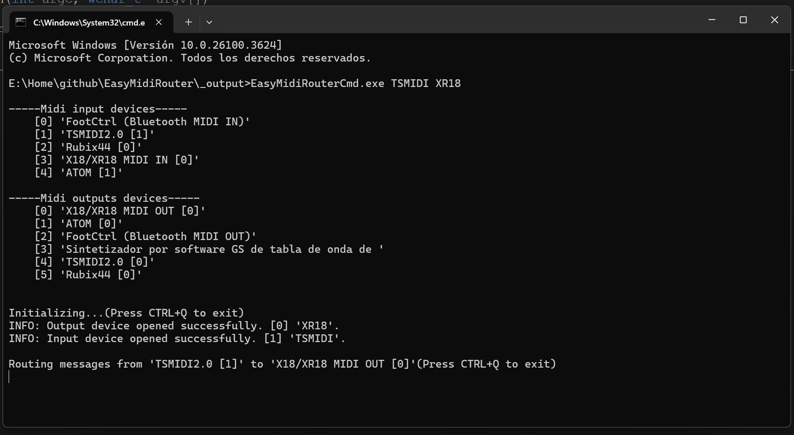
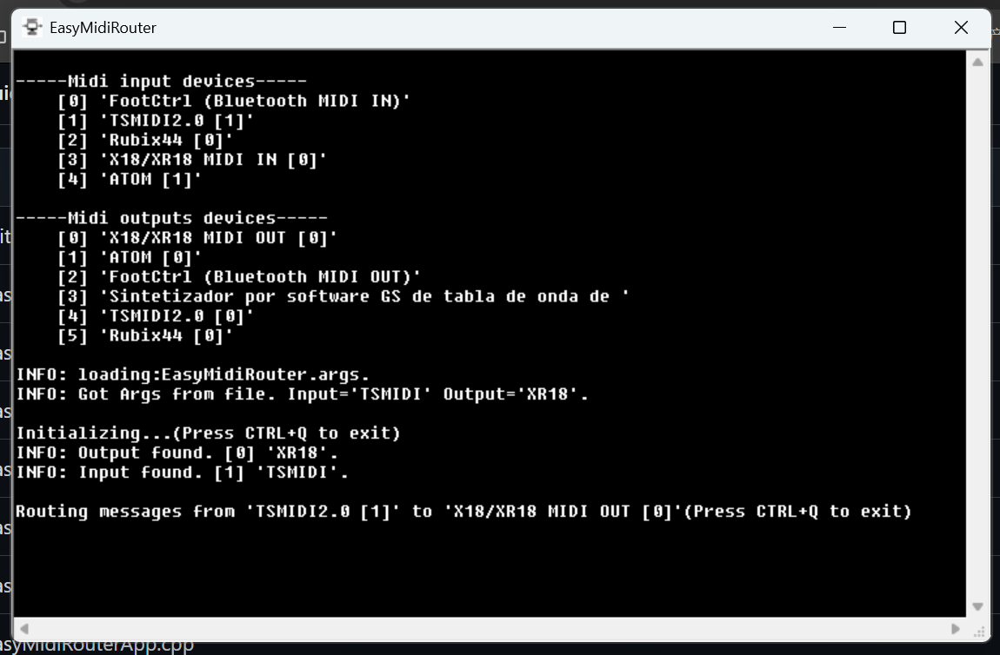
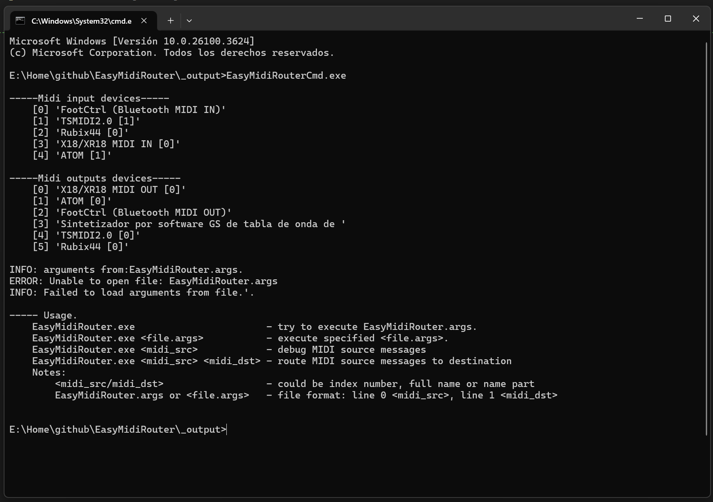
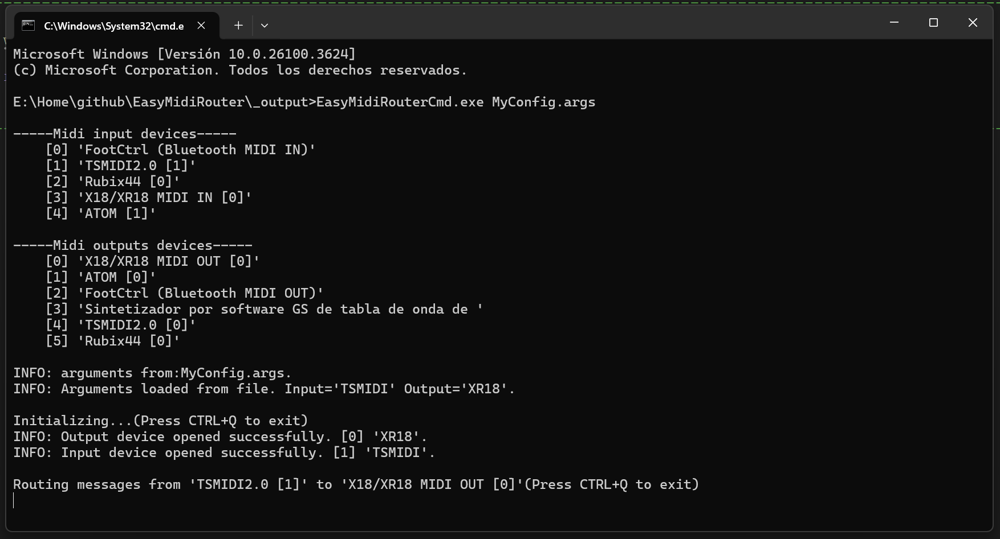
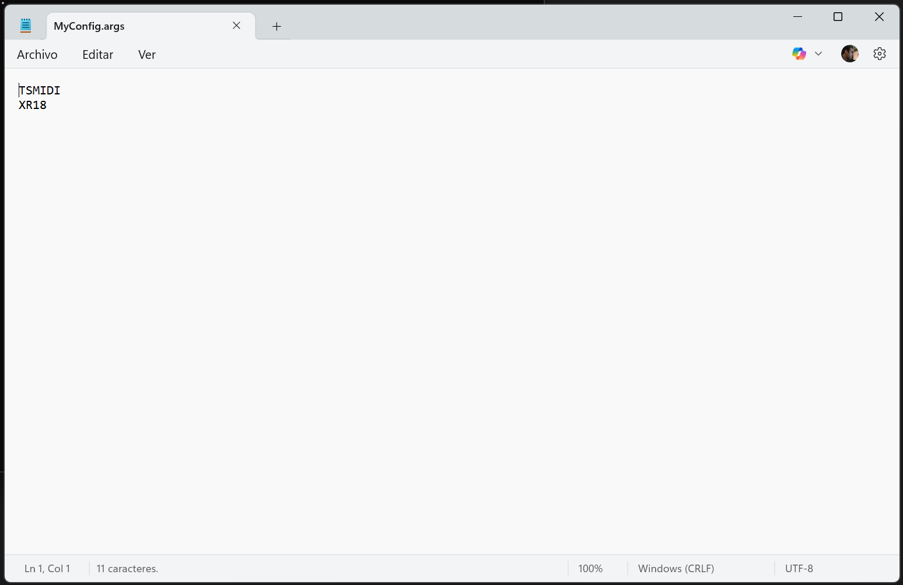
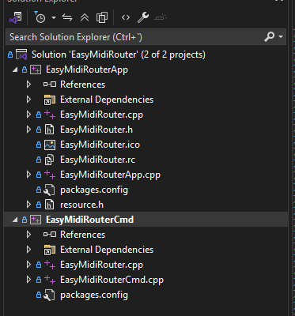
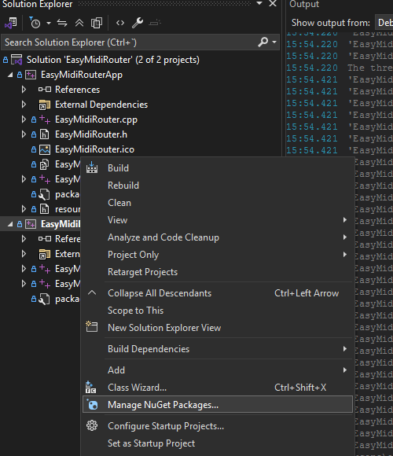

# EasyMidiRouter

## Overview

**EasyMidiRouter** is a small tool that allows you to route MIDI messages from one device to another in real time. It supports Bluetooth MIDI devices.

### Why EasyMidiRouter?

I previously used **MIDIberry** for routing, but I wanted a more flexible tool avoiding manual configuration each program start.

------

## Usage

There are two versions of the application:

1. **Cmd version**: (<u>*EasyMidiRouterCmd.exe*</u>) Intended to be used from the command line.

   <p align="center"></p>

   
2. **App version**: (<u>*EasyMidiRouterApp.exe*</u>) Suitable for pinning to the taskbar (which is not possible with command-line applications in Windows).

   <p align="center"></p>

   

Both versions offer the same core functionality. The following examples use EasyMidiRouterCmd.exe, but they are also compatible with EasyMidiRouterApp.exe. These are the available ways to run the application:

### 0. Check available MIDI device names

```
EasyMidiRouterCmd.exe
```

Running the application with no arguments will list all available MIDI input and output devices. This is useful to identify exact device names or indexes for use in routing.
<p align="center"></p>

### 1. Direct argument mode

```
EasyMidiRouterCmd.exe <midi_input> <midi_output>

# Example:
EasyMidiRouterCmd.exe TSMIDI XR18
```

You can specify device names or numeric indexes as shown when listing devices. Device identifiers can be full names, index numbers, or partial name substrings.
<p align="center"></p>

### 2. Configuration file

```
EasyMidiRouterCmd.exe <file.args>

# Example:
EasyMidiRouterCmd.exe MyConfig.args
```

<p align="center"></p>

Loads a configuration file containing:

- Line 1: Input MIDI device name (or index, or partial name)
- Line 2: Output MIDI device name (or index, or partial name)

<p align="center"></p>


See the sample file: _*EasyMidiRouter.args*.

### 3. Default configuration file

If no arguments are provided, the application will try to load a file named `EasyMidiRouter.args` from the same folder as the executable by default.

---------

## Build

This is a C++ application that uses the Windows Runtime (WinRT) API. This is required in order to access Bluetooth MIDI devices, which are not visible through older Windows MIDI APIs.

The project is configured to build with **Visual Studio 2022 Community Edition**. You can open and build the solution file: `EasyMidiRouter.sln`.

<p align="center"></p>

I don't have much experience with this kind of project that depends on NuGet packages. However, it's likely necessary to install the NuGet package `Microsoft.Windows.CppWinRT` (version used: 2.0.240405.15) in both projects in the solution: `EasyMidiRouterCmd` and `EasyMidiRouterApp`. Alternatively, it might be enough to restore NuGet packages automatically in Visual Studio.

<p align="center"></p>


(I would appreciate if someone could clarify this part!)

----------

## Future

I'm satisfied with how the application works for my personal use case, and I have no plans to develop it further. I will, however, consider fixing any problems that may arise.

